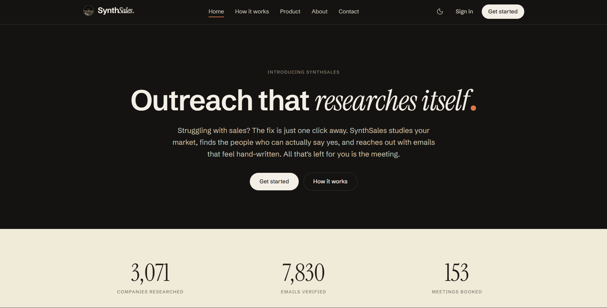
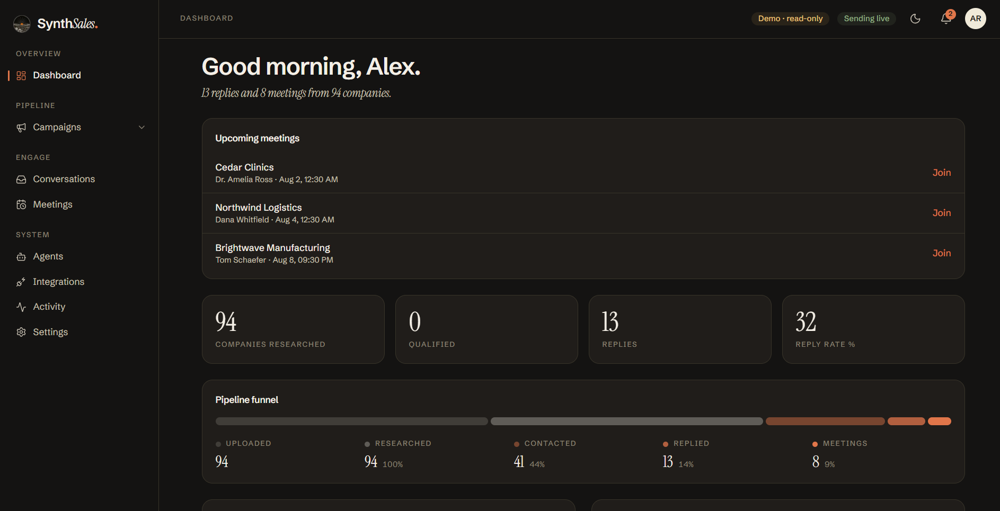
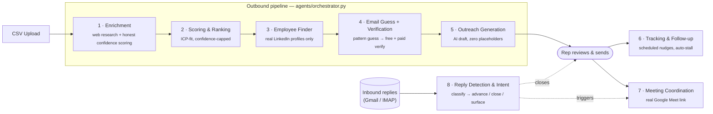
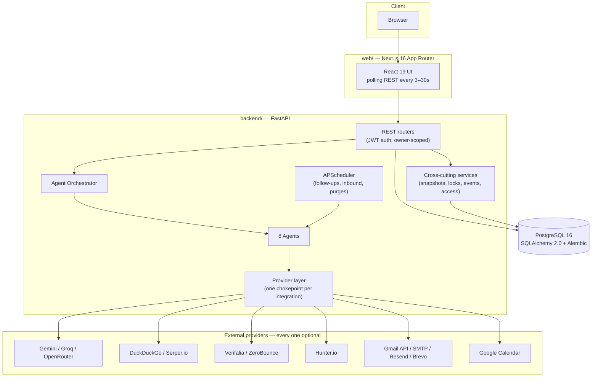

<div align="center">


### Outreach that researches itself.

An agentic B2B sales platform where **eight specialized AI agents** take a CSV of target
companies all the way to a booked meeting — researching, scoring, finding the right person,
finding and verifying their email, writing the outreach, and reading the reply — with a
built-in guarantee that no agent ever invents a fact it can't back up.

[](backend)
[](backend)
[](backend)
[](backend)
[](web)
[](web)
[](web)
[](web)

</div>

---

## Table of contents

- [What this is](#what-this-is)
- [Screenshots](#screenshots)
- [The 8-agent pipeline](#the-8-agent-pipeline)
- [What makes this more than a CRUD app](#what-makes-this-more-than-a-crud-app)
- [Architecture](#architecture)
- [Tech stack](#tech-stack)
- [Data model](#data-model)
- [Security & abuse controls](#security--abuse-controls)
- [Getting started](#getting-started)
- [Deployment](#deployment)
- [Project structure](#project-structure)
- [Engineering notes](#engineering-notes-things-worth-reading-the-code-for)
- [About this project](#about-this-project)

---

## What this is

**SynthSales** is a full-stack, AI-powered B2B outreach and lead-generation CRM. A sales rep
uploads a CSV of target companies plus a description of their product and ideal customer, and
an 8-agent pipeline takes it from there:

```
research → score & rank → find the decision-maker → find & verify their email →
write a personalized email → track replies & follow up → book a meeting with a real
Google Meet link → read inbound replies and classify intent
```

It's built as two independently deployable applications sharing one Postgres database:

- **`backend/`** — a FastAPI + SQLAlchemy 2.0 REST API that owns the agent pipeline, all
  business logic, and every integration with the outside world.
- **`web/`** — a Next.js 16 (App Router) + React 19 + Tailwind v4 single-page app that polls
  the API and gives a rep a real CRM UI: campaigns, a research/scoring board, a contacts list,
  a Gmail-style conversation inbox, a meetings calendar, and an activity/notifications feed.

The whole system is designed around one non-negotiable rule: **agents never fabricate data.**
If a company's website is dead, the enrichment agent says so instead of inventing a profile.
If the web search turns up no real LinkedIn profile, the employee-finder agent returns zero
contacts instead of guessing a name. Confidence is tracked at the field level and propagates
all the way through scoring, so a low-evidence company mathematically cannot outrank a
well-researched one.

## Screenshots

<table>
<tr>
<td width="50%">

**Marketing site**


</td>
<td width="50%">

**Dashboard** (read-only demo mode)


</td>
</tr>
</table>

> The dashboard above is the app's built-in **read-only demo** — a frontend-only mode
> (`localStorage` flag + static fixtures) that lets anyone click through every screen with
> realistic seeded data and zero backend calls, without creating an account.

## The 8-agent pipeline

Each agent is a self-contained class in `backend/app/agents/`, registered in one canonical
order, orchestrated by `agents/orchestrator.py`. A campaign can run the whole pipeline in one
click, or a single agent can be re-run on demand (e.g. "just re-score" without re-researching).



| # | Agent | What it actually does |
|---|-------|------------------------|
| 1 | **Enrichment** | Probes the company's domain for liveness (`live` / `parked` / `dead`), pulls web-search snippets, and asks the AI to synthesize an evidence-grounded profile — every field carries a 0–100 per-metric confidence, and a dead/parked domain is annotated and confidence-capped rather than researched blind. |
| 2 | **Scoring & Ranking** | Scores 6 weighted factors (product fit, industry alignment, requirement satisfaction, growth signals, …) against the campaign's ICP, discounts each factor by its underlying evidence confidence, and applies a hard confidence *ceiling* so a low-evidence company can never rank as "Strong." |
| 3 | **Employee Finder** | Runs an escalating web-search ladder (precise `site:linkedin.com/in/` queries → high-recall → founder/CEO fallback) across name/brand/domain aliases, applies a deterministic commercial-role gate plus a "currently employed here" evidence check, then lets the AI cross-check the shortlist. Zero real profiles found → zero contacts saved, never a fabricated name. |
| 4 | **Email Guess + Verification** | Generates standard `first.last@domain` pattern guesses, resolves the company's *actual* mail domain (not just its website), and verifies each candidate through a layered pipeline: free syntax/role-account/MX-DNS checks, then an optional paid provider (Verifalia/ZeroBounce). One Hunter.io lookup per company (not per contact) anchors the top contact and the mail domain cheaply; a detected catch-all server short-circuits further paid probes. |
| 5 | **Outreach Generation** | Writes a fully personalized email per contact from the enrichment profile — with a placeholder detector (`[Your Company]`, `{{merge}}`, …) and one corrective AI retry before falling back to a clean deterministic template, so a queued draft is *never* templated garbage. |
| 6 | **Tracking & Follow-up** | Polls on a schedule; nudges a thread that's gone unanswered past a configurable delay, auto-suggests replies for the rep, and auto-stalls a thread after N follow-ups with no response. |
| 7 | **Meeting Coordination** | Books a real Google Meet link on the *rep's own* connected calendar (never a fabricated link), with a double-booking guard per contact. |
| 8 | **Reply Detection & Intent** | Reads the rep's connected inbox (Gmail API or IMAP), de-dupes by provider message ID, matches the reply to the right conversation thread, and classifies intent (`interested` / `meeting_ready` / `not_interested` / `question` / `out_of_office`). A high-confidence "not interested" suppresses the contact everywhere automatically; everything else is conservative — surfaced for the human, never silently acted on (unless autonomous mode is explicitly opted into — see below). |

## What makes this more than a CRUD app

<details>
<summary><b>Zero-hallucination guarantees, not just a prompt asking nicely</b></summary>
<br/>

- Every enrichment field carries its own confidence score; scoring discounts individual
  factors by that confidence *and* is hard-capped by the company's overall
  `enrichment_confidence` — a dead-domain company mathematically cannot out-rank a
  well-evidenced one, regardless of what the LLM says.
- The employee finder's commercial-role gate is a **deterministic regex allow/deny list**
  applied *before* the AI ever sees a candidate — "Marketing Manager" and "Investment
  Analyst" never make it through even if the model would have accepted them.
- Outreach drafts run through a placeholder detector with one corrective AI retry before
  falling back to a template that is guaranteed placeholder-free — a shipped bug where drafts
  could contain literal `[briefly mention core value prop]` text was root-caused and closed
  (see `CHANGELOG.md`).

</details>

<details>
<summary><b>Real safety rails around autonomous email, not a toy toggle</b></summary>
<br/>

- Outbound sending is **off by default** for every new account (`User.outbound_enabled`), and
  fully autonomous AI replies are a *second*, independently-gated switch on top of that.
- An autonomous reply only fires when **four conditions all hold**: outbound is on, autonomous
  replies are on, the contact has a real (non-suppressed) email, and the AI's classification
  confidence clears a configurable threshold. Any handler exception falls back to surfacing the
  reply for a human instead of silently failing.
- A "not interested" classification is the only agent action that's destructive
  (`do_not_contact = true` + thread closed) — and it requires high AI confidence, never fires
  on a heuristic, and is honored by **every** send path (drafts, manual replies, follow-ups,
  meeting invites) via a single suppression flag.

</details>

<details>
<summary><b>Every third-party integration degrades gracefully — the app runs with zero API keys</b></summary>
<br/>

- **AI**: an ordered failover chain (Gemini → Groq → OpenRouter) with automatic 429 cooldown
  and retry on the next backend. No key configured → deterministic heuristics take over
  everywhere an LLM would have been used, so the app still functions end-to-end.
- **Search**: free DuckDuckGo scraping with a circuit breaker (trips after 3 consecutive
  failures, since datacenter IPs get blocked) that falls through to a Serper.io key pool,
  drained one key at a time rather than round-robin.
- **Email verification**: a free syntax → role-account → MX-DNS layer always runs; a paid
  provider (Verifalia preferred, ZeroBounce fallback) only spends a credit on addresses that
  survive the free layer, with a catch-all-domain short-circuit to avoid burning credits on
  patterns that will all return the same verdict.
- **Email sending**: console-log → SMTP → Gmail API → Resend → Brevo, auto-selected by what's
  configured, so local dev needs nothing and a cloud deploy (where outbound SMTP ports are
  often blocked) can send over HTTPS instead.

</details>

<details>
<summary><b>Multi-tenant from day one, with a real anti-abuse gate</b></summary>
<br/>

- Every table is owner-scoped; a global cross-tenant `VerifiedContact` directory lets a
  contact verified once (by any user) be reused by every future campaign for the same
  company — skipping a re-search and a paid verification credit.
- New accounts can research and build lists immediately but are **credit-capped** (2 companies,
  1 contact) until an admin approves them — the same 8 agents run either way, just bounded, so
  a free preview can't be used to run the pipeline at scale.
- One-level, 24-hour **undo** for a destructive pipeline re-run: a snapshot of every
  company/contact/draft field is captured before a forced re-run and can be restored — but
  automatically disabled the moment a real conversation exists, so a sent email can never be
  undone out from under a prospect.

</details>

<details>
<summary><b>Production-grade correctness details you'd only find by reading the code</b></summary>
<br/>

- The scheduler's two action jobs (follow-ups, inbound polling) take a **Postgres advisory
  lock** per tick, so running multiple app instances can never double-send the same follow-up.
- JWTs carry a `jti`; logout writes it to a revocation blocklist checked on every request — a
  7-day token can be invalidated immediately without a refresh-token dance.
- Enrichment fans out across a bounded thread pool (one private DB session per worker) so a
  100-company CSV researches concurrently instead of serially, without exceeding the DB
  connection pool.
- OTP codes are provenance-tagged (`V` for signup, `R` for password reset) so a code issued by
  one flow can never be replayed against the other, with brute-force lockout and IP+email
  throttling on every auth endpoint.

</details>

## Architecture



The frontend never talks to third-party integrations directly — every external call goes
through a single provider chokepoint on the backend (`providers/ai.py`, `providers/search.py`,
etc.), which is what makes the "runs with zero keys" guarantee possible: swap or remove a
provider and exactly one file changes.

## Tech stack

| Layer | Choices |
|---|---|
| **Backend** | Python 3.12, FastAPI, SQLAlchemy 2.0 (typed ORM), Alembic migrations, Pydantic v2, PyJWT, Passlib, APScheduler, httpx |
| **Frontend** | Next.js 16 (App Router), React 19, TypeScript 5, Tailwind CSS v4, no external state-management library — a thin typed `fetch` client + custom `useApi`/`useAction` hooks |
| **Database** | PostgreSQL 16 (JSONB columns for flexible agent output), Alembic-managed schema, applied on boot |
| **AI** | Gemini · Groq · OpenRouter — called directly over REST (no SDKs), ordered failover chain |
| **Search / Data** | DuckDuckGo (`ddgs`), Serper.io, Hunter.io |
| **Email verification** | Verifalia, ZeroBounce, plus a free MX/DNS + syntax layer |
| **Auth** | JWT (7-day, revocable), OTP email verification, Google OAuth (sign-in + incremental Calendar/Gmail consent) |
| **Infra** | Docker (both apps), deployed live on **Render** (API) + **Vercel** (web) + **Neon** (managed Postgres), with a Render Blueprint (`render.yaml`) for one-click infra provisioning |

## Data model

Owner-scoped, cascade-deleting core tables: `User → Campaign → Company → Contact →
EmailDraft`, plus `Thread`/`Message` for conversations, `Meeting`, `Notification`, `Log`, and
`AgentConfig` (per-user, per-agent status the UI polls). Two tables exist purely to make the
system trustworthy at scale:

- **`VerifiedContact`** — a global, cross-tenant directory keyed by normalized company
  domain/name, so a contact verified once is never re-searched or re-verified for a different
  campaign.
- **`PipelineSnapshot`** — a serialized before/after picture of a campaign's pipeline output,
  powering the one-level 24-hour undo.

Status lifecycles are explicit and UI-driven: `Company.status` (`Researching → Qualified /
Reviewed → Approved / Excluded / Contacted`), `Contact.verification` (`Unknown → Verified /
Risky / Invalid`), `Thread.stage` (`Contacted → Replied → Negotiating → Meeting / Closed /
Stalled`).

## Security & abuse controls

- **Outbound kill-switch** — no real email reaches a prospect until a user explicitly flips
  `outbound_enabled` in Settings; every send path checks it.
- **Access gating** — an admin-approval workflow partitions the 8 agents into "free, capped"
  research agents and "approved only" outreach/send agents, preventing the platform from being
  used to spam at scale by an unreviewed account.
- **Rate limiting** — per-IP and per-email throttles (in-memory, or Redis-backed for a
  multi-instance deploy) on registration, OTP resend, and password reset, plus OTP
  brute-force lockout.
- **JWT revocation** — logout invalidates the specific token server-side via a `jti`
  blocklist, purged hourly once expired.
- **CSRF-safe OAuth** — Google OAuth uses a signed-state double-submit pattern; per-user
  Calendar/Gmail consent grants are bound back to the authenticated user via a short-lived
  signed JWT, not a server-side session store.

## Getting started

Two terminals, PostgreSQL via Docker.

```bash
# 1. Backend
cd backend
docker compose up -d                 # Postgres 16 on host port 5433
cp .env.example .env                 # fill in whichever API keys you have — none are required to boot
python -m venv .venv && .venv\Scripts\activate   # Windows; use source .venv/bin/activate on macOS/Linux
pip install -r requirements.txt
python -m uvicorn app.main:app --reload --port 8000
# → API: http://127.0.0.1:8000  ·  Swagger UI: /docs  ·  GET /health shows which integrations are live

# 2. Frontend
cd web
npm install
npm run dev
# → http://localhost:3000
```

The backend boots with **zero credentials** — every integration above degrades gracefully
until you add real keys. A demo account is auto-seeded in development
(`jordan@apexcloud.com` / `password123`), or use the **"View live demo"** button on the signup
page for a fully static, read-only walkthrough with realistic seeded data and no backend at
all.

There's no automated test suite; the verification loop is `npm run build` (which typechecks
every route) on the frontend, and `GET /health` + the included `db.ps1` read-only Postgres
inspector on the backend.

## Deployment

Both apps ship as Docker images and are deployed independently:

- **`backend/Dockerfile`** — runs Alembic migrations on boot, then a single `uvicorn` worker
  (correctness over throughput; horizontal scaling is done by running more instances, guarded
  by Postgres advisory locks in the scheduler).
- **`web/Dockerfile`** — Next.js 16 standalone output; `NEXT_PUBLIC_API_URL` is inlined at
  **build time**, not read at runtime.
- **`render.yaml`** — a Render Blueprint that provisions the API, a Redis-compatible rate-limit
  store, and wires them together in one click; see `DEPLOY.md` for the full walkthrough
  (Render, Railway, and Fly.io) and the required-vs-optional environment variable checklist.

## Project structure

```
backend/app/
├── agents/          # the 8 agents + orchestrator (base.py::AGENT_REGISTRY is the source of truth)
├── api/routers/      # FastAPI routers — one file per resource, all owner-scoped
├── core/             # config, DB session, security (JWT/passwords), rate limiter
├── providers/        # every external integration behind one chokepoint each
├── services/         # cross-cutting logic: access gating, snapshots, pipeline locks, events
└── workers/           # APScheduler background jobs

web/src/
├── app/
│   ├── (marketing)/  # public site — landing, about, docs, changelog
│   ├── (auth)/        # login, signup, forgot-password, OAuth callback
│   └── (app)/          # the authenticated product — dashboard, campaigns, research,
│                        # contacts, outreach, conversations, meetings, agents, admin, settings
├── components/         # shared UI + feature components
└── lib/                 # typed API client, hooks, demo-mode fixtures, shared constants
```

## Engineering notes (things worth reading the code for)

This project was built iteratively with a running engineering log kept in
[`CHANGELOG.md`](CHANGELOG.md) — every dated entry explains a real bug, its root cause, and
the fix, rather than just "what changed." A few examples if you want to see the debugging
depth: a production incident where every cold visit silently logged users out (turned out to
be a `5xx` from a sleeping free-tier instance being treated as an invalid session); a live
database migration off an expiring free-tier Postgres with zero data loss; and a shipped fix
for outreach drafts that could leak literal `[Your Company]` placeholder text into a sent
email. The full as-built system specification (mirroring the original PRD, with every
divergence called out) lives in [`spec.txt`](spec.txt).

## About this project

Built together by:

- [**Arnav Joshi**](https://github.com/Arnav020)
- [**Pulkit Garg**](https://github.com/PulkitGarg31)
- [**Navnoor Bawa**](https://github.com/NavnoorBawa)

as a hands-on exploration of building a genuinely agentic product — not a chatbot wrapper, but
a pipeline of narrow, accountable agents that each own one job, hand off clean state to the
next, and are individually re-runnable, undoable, and auditable.

